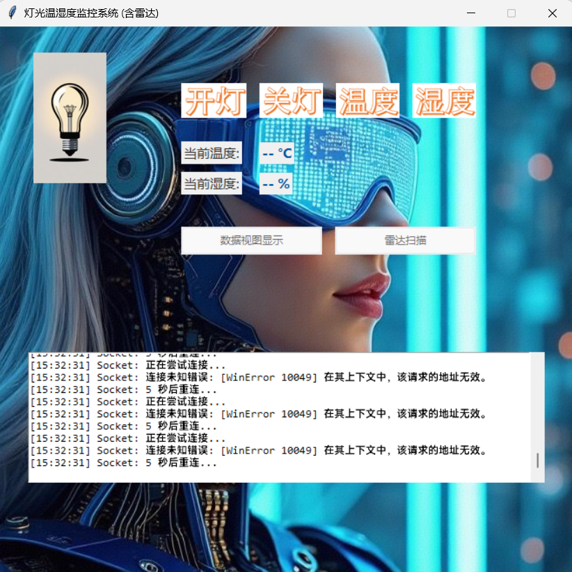
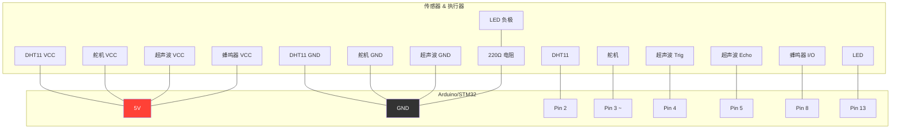

#Arduino 多功能环境监测与雷达扫描系统

这是一个功能强大的物联网(IoT)项目，它将**Arduino**作为下位机，负责采集环境数据和执行硬件控制，并通过 **Python Tkinter** 编写的上位机软件进行实时监控、数据可视化和远程控制。系统通过 **TCP/IP 协议** 与云端服务器通信，实现了数据的云端存储和潜在的远程指令下发。

**本项目主要包含三个核心部分：**

1.  **Arduino 硬件控制器**：负责驱动舵机、超声波雷达、DHT11 温湿度传感器、LED 和蜂鸣器。
2.  **Python 本地监控 GUI (`dht_and_radar_monitor.py`)**：一个功能丰富的图形化界面，用于：
    - 显示实时温湿度和灯光状态。
    - 提供雷达扫描的极坐标实时视图。
    - 绘制温湿度历史数据曲线图和仪表盘。
    - 将所有数据通过 TCP 协议发送到服务器。
3.  **Python 云端服务器 (`服务器.py`)**：一个基于 Socket 的 TCP 服务器，用于：
    - 接收来自客户端的数据。
    - 将数据解析并存储到 SQLite 数据库中。
    - （可扩展）向客户端发送控制指令。

---

## 🎬 项目演示

**GUI 界面截图:**


---

## ✨ 主要功能

- **📡 雷达扫描与避障**：通过舵机和超声波传感器实现 **180 度扇形区域** 的距离探测，并在 GUI 上实时显示极坐标雷达图。
- **🚨 距离分级报警**：雷达探测到不同距离的障碍物时，会触发蜂鸣器以 **不同频率** 鸣叫，实现分级预警。
- **🌡️ 温湿度实时监测**：使用 DHT11 传感器采集环境温湿度，并在 GUI 上显示实时数值和历史曲线。
- **💡 远程灯光控制**：通过 GUI 界面按钮，可以远程控制连接在 Arduino 上的 LED 灯的开关。
- **📊 丰富的数据可视化**：
  - 动态的极坐标雷达图，显示扫描线和探测点。
  - 实时更新的仪表盘（圆形和矩形），直观展示温湿度。
  - 可滚动的历史数据曲线图，回顾数据变化趋势。
- **☁️ 云端数据同步**：所有传感器数据（温湿度、雷达）都被打包成 **JSON 格式**，通过 TCP Socket 实时发送到云服务器。
- **💾 数据持久化存储**：服务器端将接收到的数据存入 **SQLite 数据库**，便于后续分析和查询。

---

## 🔌 硬件接线图

请根据您的 Arduino 开发板型号，参考下图进行硬件连接。本项目使用了 **低电平触发的有源蜂鸣器**。

| Arduino/STM32 引脚  | 连接到                       | 功能说明                        |
| :------------------ | :--------------------------- | :------------------------------ |
| **5V / VCC**        | 所有模块的 VCC/5V 引脚       | 为所有模块提供 5V 电源          |
| **GND**             | 所有模块的 GND 引脚          | 所有模块共地                    |
| **Pin 2 (数字口)**  | DHT11 传感器的 DATA 引脚     | 温湿度数据输入                  |
| **Pin 3 (PWM 口)**  | 舵机(Servo)的信号线 (橙/黄)  | 控制舵机旋转，实现雷达扫描      |
| **Pin 4 (数字口)**  | 超声波(HC-SR04)的 Trig 引脚  | 超声波测距触发信号              |
| **Pin 5 (数字口)**  | 超声波(HC-SR04)的 Echo 引脚  | 超声波测距回响信号              |
| **Pin 8 (数字口)**  | 有源蜂鸣器(Buzzer)的信号引脚 | 报警发声 (低电平触发)           |
| **Pin 13 (数字口)** | LED 的阳极(+)                | 灯光控制 (另一端通过电阻接 GND) |

### 接线示意图



_Tips: 上图由 Mermaid 语法绘制，在 GitHub 上会自动渲染成清晰的流程图。_

---

## 🚀 使用说明

请严格按照以下顺序启动和配置系统：

### 步骤 1: 烧录 Arduino 代码

1.  使用 Arduino IDE 打开项目中的 `.ino` 文件。
2.  在 "工具" -> "开发板" 中选择你的 Arduino 型号（`Arduino Uno`）。
3.  在 "工具" -> "端口" 中选择你的 Arduino 连接的 COM 口。
4.  点击 "上传" 按钮，将代码烧录到开发板中。

### 步骤 2: 启动云端服务器

1.  **修改 IP 地址**：打开 `服务器.py` 文件，找到 `HOST` 变量，将其值修改为您 **作为服务器的电脑的局域网 IP 地址**。例如：`HOST = "127.0.0.1"`。
2.  **运行服务器**：在终端或命令提示符中，运行服务器脚本：
    ```bash
    python 服务器.py
    ```
3.  如果一切正常，您会看到 "Server listening on [Your_IP]:8888..." 的日志输出。**请保持此窗口运行**。

### 步骤 3: 启动本地监控 GUI

1.  **修改 IP 地址**：打开 `dht_and_radar_monitor.py` 文件，找到 `SERVER_IP` 变量，将其值修改为 **上一步中服务器的 IP 地址**。这两个 IP 必须完全一致。
2.  **运行 GUI 程序**：在另一个终端或命令提示符中，运行监控 GUI 脚本：
    ```bash
    python dht_and_radar_monitor.py
    ```
3.  程序启动后，会自动查找并连接到 Arduino。连接成功后，GUI 界面将显示，并开始与服务器通信。

现在，您可以通过 GUI 界面控制灯光、查看温湿度，并启动雷达扫描了！

---

## 🛠️ 开发环境与依赖

### Arduino

- **IDE**: Arduino IDE 1.8.x 或更高版本
- **库**:
  - `Servo.h`
  - `NewPing.h`
  - `DHT.h` (Adafruit DHT sensor library)

### Python

- **版本**: Python 3.7+
- **库**:

  - `tkinter` (Python 标准库)
  - `pyserial`
  - `sqlite3` (Python 标准库)
  - `Pillow (PIL)`
  - `numpy`
  - `matplotlib`

  您可以通过以下命令安装所有必要的 Python 库：

  ```bash
  pip install pyserial Pillow numpy matplotlib
  ```

## 📜 许可证

本项目采用 [MIT License](LICENSE) 开源协议。
